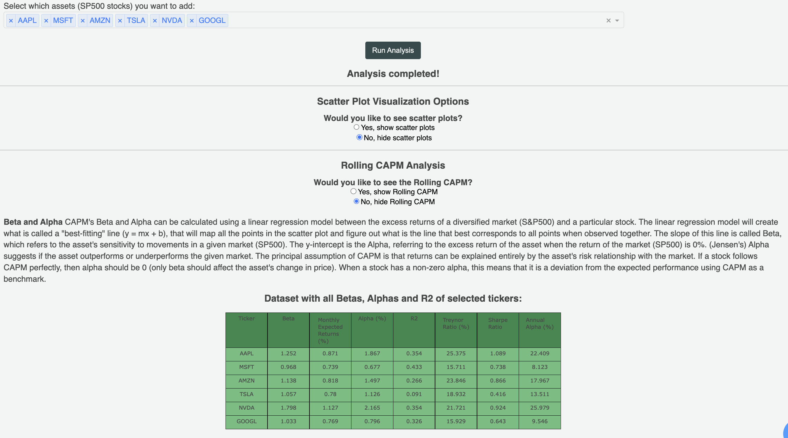

# CAPM-Based Risk and Return Analysis

## Overview
This application provides CAPM Risk-Return Analysis Tool for stocks listed in the S&P500, allowing users to calculate Expected Returns, Beta and Alpha for the given asset. The program will calculate the Betas, Jansen's Alphas (using the OLS best-fitting line module), R2 (of the best-fitting line), Sharpe Ratio, Treynor Ratio and Rolling CAPM Analysis (Rolling Beta, Rolling Alpha and Rolling R2). This provides the user a comprehensive understanding and a clear visualization of assets' risk, and their relationship with the S&P 500.

## Modules and Libraries
- Pandas --> handling dataframes, cleaning and preprocessing data
- Plotly --> plotting graphs, tables and bar charts for data visualization
- Dash --> plotly module to create webApp and visualize figures from plotly
- Statsmodels --> linear regression (OLS - best-fitting line) and rolling regression (RollingOLS)

## Removing Outliers
It was necessary to remove outliers for a more accurate understanding of the asset's behavior compared to the S&P500 and better analyze central tendency. The method used was the IQR method. 

## Data Sources (yFinance API)
This application makes use of the yFinance API for fetching stocks (tickers) informations, using 20-year historical data from Yahoo Finance. The yFinance API is free and has current and updated data of the market of equities and other financial databases. The program will fetch a given ticker data, specifically the returns data, and will calculate excess returns of the ticker, comparing it with the excess return of the S&P 500. This excess return is the core part of the program, as it will be used for creating the OLS Best-Fitting line that calculates  Betas, Alphas, R2, Best-Fitting line.

## What is CAPM?
CAPM is a model that measures an asset's expected returns based on systematic risk (undiversifiable risk). It quantifies how much an asset moves to the overall market or a proxy.

**CAPM Formula:** *E(rA) = rf + βA × (E(rm) - rf)*

Where:

- **Beta (β):** Represents the asset's sensitivity to market movements (essentially showing its systematic risk). If an asset's beta is 2, then you expect the asset to have 2% if the market has 1% returns, or -2% returns if the market has -1% return
- **rf:** Risk-free rate (Treasury Bills 20yr interest rate)
- **E(rm):** Expected returns of the market. There are many ways to calculate this, but this application is using historical returns of the given asset and market. 
-**E(rA):** Expected returns of an asset

### Expected Returns
While CAPM technically gives us an estimate of future expected returns based on past returns, it assumes that the historical relationship between the stock and the market (Beta) will remain constant in the future, which is not the case in real life. Even though CAPM grasps the relationship between the stock and the market, this relationship changes over time. When using the historical returns of the S&P500 as expected returns, we assume the past 20 years of returns will repeat in the future. 

## Excess Returns
The application uses the yFinance module to extract monthly returns of a given stocks (selected by the user) and calculates their excess returns when compared to the risk-free rate (Excess Returns = Asset Returns - Risk-Free Returns). It does the same calculation for the S&P500. For each monthly interval, the application will calculate the given excess return of the asset and the S&P500, finally plotting them all in a scatter plot. Each blue dot in the plot corresponds to the Excess Returns of the asset and of the S&P500 at each given month in the past 20 years:

### Regression (Best-Fitting) Line (y = βx + α)
The model performs linear regression using the plotted points, creating the orange best-fitting line, and calculates R-Squared. Simply, linear regression is responsible for analyzing all the points in the scatter plot and calculating what is the line that best fits to all points together. This linear regression is responsible for finding the Beta (β) and Alpha (α), which correspond to the slope (β) and y-intercept (α) of the line, respectively. 

### Beta (β) and Jensen's Alpha (α)
Beta (β), slope of the best-fitting line, refers to the asset's sensitivity to movements in a given market (S&P500), essentially showing its systematic risk (undiversifiable risk). Alpha (α), y-intercept of the best fitting line, is the excess return of the asset when the return of the market (S&P500) is 0%. It suggests if the asset outperforms or underperforms the given market. The principal assumption of CAPM is that returns can be explained entirely by the asset's risk relationship with the market. If a stock follows CAPM perfectly, then alpha should be 0 (only beta should affect the asset's change in price). When a stock has a non-negligible alpha, this means that it is a deviation from the expected performance using CAPM as a benchmark, in other words, CAPM might be insufficient for calculating this asset's returns.

## Rolling CAPM Analysis
Rolling CAPM calculates the key CAPM parameters (Beta, Alpha, and R-squared) over sequential time periods using a moving window of data. Rather than using the entire historical dataset to calculate a single Beta value, Rolling CAPM uses a fixed-size window (typically 12, 24, or 36 months) that "rolls" forward through time.

### Rolling Beta
Shows how a stock's sensitivity to market movements (systematic risk) changes over time. Helps identify if an asset is becoming more or less volatile relative to the market. Reveals periods when an asset's market correlation strengthens or weakens.

### Rolling Alpha
Tracks how a stock's excess returns (performance beyond what would be expected given its risk) change over time. Helps identify periods when a stock consistently outperforms or underperforms the market. Can reveal how management changes, business cycles, or economic conditions affect performance.

### Rolling R2
Measures how well the market's movements explain the asset's returns in each period. A decreasing R-squared might indicate increasing influence of company-specific factors. Higher values show stronger correlation with the market during that period.

## Treynor Ratio
A performance metric that measures the excess return per unit of systematic risk. It evaluates how much return an asset/portfolio generates for each unit of market risk (beta) it takes. Unlike the Sharpe Ratio, which uses total risk (standard deviation) in its calculation, the Treynor Ratio only considers systematic risk (risk that cannot be diversified away), hence using Beta for the calculation. A higher Treynor Ratio indicates better risk-adjusted performance relative to market risk, meaning the investment is generating more excess returns per unit of systematic risk (beta).

## Sharpe Ratio
Similar to the Treynor Ratio, Sharpe Ratio also measures the return of an investment with its risk. Instead of using the beta for calculating market risk (Treynor Ratio), the Sharpe Ratio uses uses total risk (standard deviation) in its calculation. 

